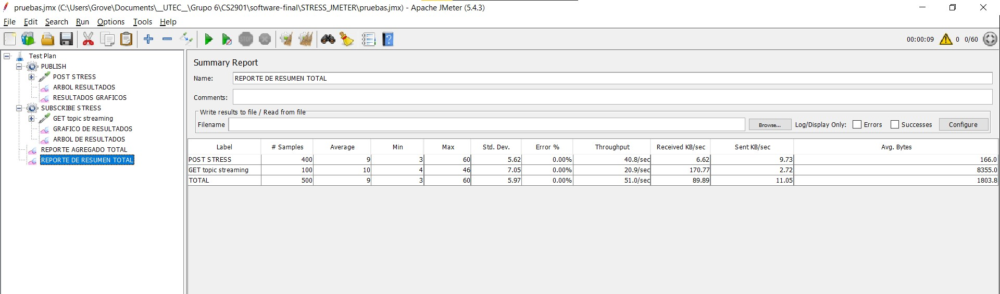

# software-final

Como se aprecia en el resumen general de los stress test:
- Throughputs de acuerdo a los lineamientos (post: 40 req/sec ; get: 20 req/sec)
- Se obtiene un error de 0%

Timeout establecido de requests:

Detalles de las consultas y respuestas:
POST (INCLUYE HEADERS):

GET:

Finalmente observamos que los gráficos de thread groups muestra que el tiempo nunca es excedido con sus throughputs definidos:
PUBLISH (2000 ms):

SUBSCRIBE (1000ms):

